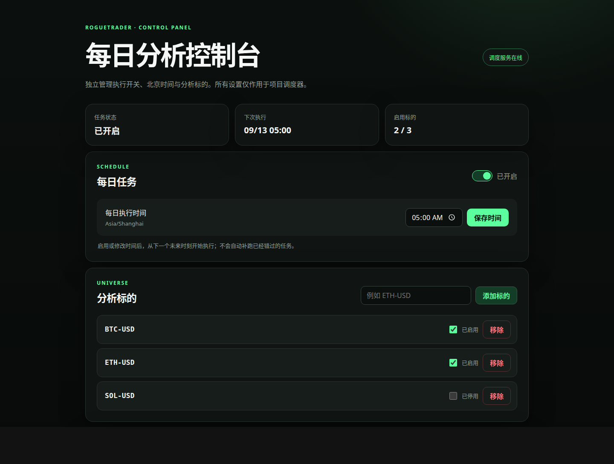

# RogueTrader

<p align="center">
  <strong>多智能体投研委员会：多源研究、对抗论证、风险裁决与生产化交付</strong>
</p>

<p align="center">
  <a href="README.md">中文</a> ·
  <a href="README.en.md">English</a> ·
  <a href="backtest/README.md">回测结果</a> ·
  <a href="ROADMAP.md">Roadmap</a> ·
  <a href="docs/control-panel.md">控制面板</a> ·
  <a href="docs/production-development.md">生产运维</a>
</p>

RogueTrader 不让单一模型直接猜测涨跌，而是把投资决策组织成一支职责分明的 Agent 团队：多维研究、交叉质询、交易规划和风险终审层层推进。项目再用自有调度器与 CSV-first 发布链路，让这套“虚拟投研委员会”可每日运行、全程留痕并稳定交付。

> 这是研究分析系统，不是自动实盘交易系统，也不构成投资建议。

## Agent 团队架构

系统最多编排 14 个专业角色，形成从证据研究到可执行表达的五层协作结构：

```text
情报层  Intelligence
  市场 · 社交 · 新闻 · 基本面 · 链上分析师
                    ↓ 独立证据报告
论证层  Deliberation
             多头研究员 ↔ 空头研究员
                    ↓ 研究经理裁决
策略层  Strategy
             交易员：方向 · 仓位 · 条件计划
                    ↓
风控层  Risk Committee
        激进风控 ↔ 中立风控 ↔ 保守风控
                    ↓ 投资组合经理终审
执行层  Execution
       非投票执行规划 Agent：多场景参数化委托
```

这不是简单的 Agent 串联：研究结论必须经过“多空论证 → 经理裁决”，交易策略还要经过“三方风控 → 组合终审”。最终评级确定后，独立执行规划 Agent 只负责把结论翻译成可审计指令，不参与投票，也不能改变评级。



_图片为脱敏示例状态，不包含真实凭据、个人路径或实际决策内容。_

## 核心能力

- **可编排 Agent 团队**：按标的选择研究席位，按角色分配快速/深度模型，并独立设置研究与风控辩论轮数。
- **双层对抗式决策**：多空研究与风险三方辩论分别由经理角色独立裁决，避免把最终结论压缩成一次模型调用。
- **参数化执行计划**：用 `X_POSITION` / `X_CASH` 直接表达多场景、多委托指令，并自动承接同标的上一份计划；每日无需账户输入，飞书合并卡片按“指令在前、决策在后”展示，真实下单始终禁用。
- **每日自动调度**：本机控制面板管理总开关、北京时间、分析标的和每个标的的独立开关。
- **多标的串行执行**：同一批标的依次运行，避免模型额度和数据源并发争用。
- **CSV-first 发布**：每个完整结果先幂等追加到决策主表；多场景委托再展开为独立的参数化委托明细表，适合跨日、跨标的筛选。
- **分层验证闭环**：`Signal / Plan Lifecycle Quality` 按参数化计划的真实有效期评价局部决策贡献；OHLCV 与多因子组合回放继续验收最终 PnL。
- **时点数据治理**：每次工具调用留下私有快照、参数哈希与数据血缘；历史补跑缺少匹配快照时安全停止，不允许把今天的数据伪装成过去。
- **飞书双通道**：向飞书群发送“执行指令 + 完整决策摘要”的合并卡片，同时向普通电子表格追加一行。
- **失败隔离**：消息或表格失败只重试对应通道，不会重新触发付费分析。
- **不可变生产版本**：生产环境运行固定 Git 标签、锁定依赖和独立虚拟环境，旧版本始终可回滚。
- **开发/生产隔离**：源码、状态、缓存、结果目录和 `.env` 分离，开发不会覆盖生产运行态。

## 60 日历史验证

基于 55 份研究合格计划、298 条参数化委托和 1,440 根真实 1H K 线，系统完成了从 Agent 决策到连续组合回放的闭环。另有 1 份延迟修复决策因缺少当时数据快照被隔离，视为当日无新交易。结果为计入手续费和滑点的事后模拟，不是实盘收益。

| | OHLCV 基础版 | 多因子条件版 | BTC 持有基准 |
|---|---:|---:|---:|
| 收益 | **+8.03%** | **+6.82%** | +25.47% |
| 最大回撤 | -2.24% | -2.57% | -6.45% |
| 成交 | 22 | 35 | — |

治理修正说明一份污染决策或一条错误解释的条件都足以改变组合结论；修正后系统仍降低了回撤，也仍明显错过强势趋势。生命周期评估不再把每日评级假设为固定期限预测：27 份实际成交计划中，48.15% 优于相同初始状态下的“原地不动”，平均价值增量为 -0.08%、中位数为 -0.01%。查看[完整回测结果](backtest/README.md)、[Signal Quality 方法](docs/signal-quality.md)与[证据复盘](docs/validation-evidence.md)。

## 演进路线

```text
Foundation → Operations → Decision Integrity → Execution Intelligence → Validation Loop → Portfolio Intelligence
   v1.0         v1.1             v1.2                  v1.3               v1.4               Horizon
```

项目正从“可重复运行的多智能体研究”走向“可衡量、可反馈的投资决策智能”。查看完整的 [Evolution Roadmap](ROADMAP.md)。

## 工作流程

```text
本机控制面板
  └── Asia/Shanghai 每日调度
        └── 多标的串行分析
              └── 完整运行结果
                    ├── 运行清单.json（全生命周期）
                    ├── 运行索引.json（成功完成标记）
                    ├── 最终决策.json
                    └── 执行计划.json（可选，仅模拟）
                              ↓
                    每日决策.csv（审计事实来源）
                              ├── 时点资格门禁
                              │     ├── Signal / Plan Lifecycle Quality
                              │     │     └── 激活 → 条件/成交 → 止盈止损/更新/到期
                              │     └── 研究委托投影
                              │           └── Portfolio PnL → OHLCV / 多因子
                              ├── 本地消息包
                              ├── 飞书群合并卡片
                              └── 飞书电子表格新行
```

发布器只消费完整结果。CSV、飞书消息和飞书表格分别记录状态，任何通知失败都不会反向影响分析任务。

## 快速操作

### 生产控制面板

```bash
ops/production-control-panel-service start
ops/production-control-panel-service status
ops/production-control-panel-service stop
```

启动后访问 <http://127.0.0.1:8765>。面板只监听本机回环地址；后台服务需要保持运行，每日任务才会按时触发。

### 手动分析

```bash
uv run --frozen python my_scripts/roguetrader0.py \
  --ticker BTC-USD \
  --date 2026-09-12 \
  --no-debug
```

手动入口支持修改标的、日期、分析师、模型和辩论轮数。完整参数见[开发与手动运行](docs/development.md)。

### 查看生产版本

```bash
./ops/release_manager.py status
./ops/release_manager.py list
.runtime/bin/run-version --check
```

发布与回滚流程见[生产/开发双模式](docs/production-development.md)。

## 结果结构

```text
my_results/
├── 运行结果/
│   └── 20260913_115207__asof-20260913__prod__recovery-a02__BTC_USD/
│       ├── 运行清单.json
│       ├── 运行索引.json
│       ├── 最终决策.json
│       ├── 执行计划.json
│       ├── 执行实例.json（手动绑定后可选）
│       ├── 报告.md
│       ├── 状态.json
│       ├── 运行配置.json
│       ├── 终端日志.log
│       └── 分段报告/
├── 汇总/
│   ├── 每日决策.csv
│   ├── 参数化委托.csv
│   └── 消息/
├── 回测数据/
│   └── 多因子条件版/<采集时间>__BTC_USD/
└── 回测结果/
    ├── <回测时间>__BTC_USD/（OHLCV 基线）
    └── 多因子条件版/<回测时间>__BTC_USD/
        ├── 回测指标.json
        ├── 权益曲线.csv
        ├── 成交明细.csv
        ├── 委托回测状态.csv
        ├── 条件解析审计.csv
        ├── 数据质量.json
        ├── 数据来源.json
        ├── 回测报告.md
        ├── 回测报告.html
        ├── 验证方法.ipynb
        └── 结果清单.json
```

目录名依次表达实际启动时间、请求分析日期、运行环境、触发类型、尝试次数和标的。失败运行也保留清单，但只有成功运行拥有 `运行索引.json`，因此不会被误发布。历史和迁移规则见[运行结果协议](docs/run-results.md)。

同一天的多个标的在决策主表中各占一行；每份执行计划在委托明细表中按“场景 × 委托”展开，并分别使用稳定 ID 幂等去重。历史正式决策也可按时间顺序补生成执行计划，无需重跑完整 Agent 团队。详细协议见[本地结果发布器](docs/local-publisher.md)。

## 生产与开发

| | 生产模式 | 开发模式 |
|---|---|---|
| 代码 | `.runtime/production/current` 指向不可变版本 | `.runtime/development/worktree` 的 `develop` 分支 |
| 环境 | 每个版本独立 `.venv` | 开发专用 `.venv` |
| 配置 | `.runtime/production/.env` | `.runtime/development/.env` |
| 状态 | `.runtime/production/control-panel` | 开发 worktree 内 `.runtime/control-panel` |
| 结果 | 项目根目录 `my_results/` | 开发 worktree 内 `my_results/` |

两个面板默认使用相同本机端口，因此同一时间只运行一个。生产状态和发布数据库不位于版本源码目录中，升级后会继续沿用。

## 安全边界

- `.env`、密钥、运行结果、CSV、SQLite 状态库和日志均被 Git 忽略。
- 控制面板不返回密钥，也不展示完整分析报告或决策正文。
- 飞书凭据只从当前运行环境的 `.env` 读取。
- 首次启用发布通道只建立历史基线，默认不回发旧结果。
- 对飞书表格的数据行排序或筛选不影响按 `event_id` 去重；不要移动表头或修改协议列。

## 首次开发安装

需要 Python 3.10+ 和 [uv](https://docs.astral.sh/uv/)：

```bash
uv sync --frozen
cp .env.example .env
./ops/release_manager.py bootstrap
./ops/release_manager.py setup-development
```

只把真实凭据写入本地 `.env`，不要提交。完整步骤见[开发与手动运行](docs/development.md)。

## 文档导航

- [项目演进路线](ROADMAP.md)：重大版本、战略阶段与长期方向。
- [控制面板](docs/control-panel.md)：开关、时间、标的和发布通道。
- [本地结果发布器](docs/local-publisher.md)：CSV-first、幂等、重试和飞书协议。
- [运行结果协议](docs/run-results.md)：目录命名、运行清单、重跑和历史迁移。
- [参数化执行计划](docs/execution-plans.md)：多场景委托、X 参数、跨日承接和可选模拟绑定。
- [参数化委托回测](docs/execution-backtest.md)：委托时间、真实 OHLCV、成交模型和报告口径。
- [多因子条件回测](docs/execution-backtest-multifactor.md)：ETF、情绪、链上、宏观条件的时点重放与证据分级。
- [Signal Quality](docs/signal-quality.md)：计划自然生命周期、逐单状态与局部原地不动反事实。
- [60 日完整回测结果](backtest/README.md)：信号质量、基础版与多因子版的报告和审计数据。
- [60 日历史验证解读](docs/validation-evidence.md)：收益、回撤、基准比较与策略复盘。
- [生产/开发双模式](docs/production-development.md)：不可变发布、激活与回滚。
- [分析引擎](docs/analysis-engine.md)：智能体角色、辩论流程和决策输出。
- [模型与数据源](docs/providers-and-data.md)：Provider、行情、链上数据和标的格式。
- [开发与手动运行](docs/development.md)：安装、测试、CLI 与本地数据模式。
- [每日任务健康审计](docs/daily-health-monitor.md)：检查时间、失败分类和重试边界。
- [变更记录](CHANGELOG.md)：生产版本的主要变化。

## 验证

```bash
uv run --frozen python -m unittest discover -s tests -v
uv run --frozen python -m compileall -q cli roguetrader tests my_scripts main.py
```

当前测试覆盖调度配置、控制面板安全策略、运行目录、信号提取、双 CSV 幂等、历史计划回填、研究隔离与链路重接、数据快照重放、Signal Quality、OHLCV 与多因子回测、飞书消息、飞书表格以及发布重试。

## 许可证与来源

Apache License 2.0，详见 [LICENSE](LICENSE)。

RogueTrader 基于 Tauric Research 的 [TradingAgents](https://github.com/TauricResearch/TradingAgents) 演进而来；归属与修改说明见 [NOTICE](NOTICE)。
